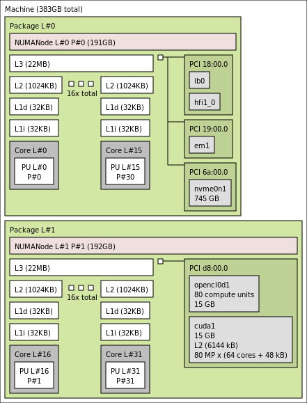

# GPU To NIC Rail Mapping

**Goal**: The goal of this project is to provide a simple mechanism to map which GPUs are associated to which NICs on the same PCIe busses inside a baremetal system.  This mapped information can then assist in generating a OpenShift MachineConfig that can identify one network card per GPU on the same PCI root complex and call that the rail nic while marking any others as secondary.   This is primarily for Spectrum-X but could be used across any platform where GPU to NIC coherency is important in regards to configuration for OpenShift.

## Contents

- [Why](#why)
- [hwloc](#hwloc)
- [gpu-nic-rail-mapping](#gpu-nic-rail-mapping)

## Why

For optimal cluster performance and minimal latency, it’s essential to align each GPU with its nearest high-speed NIC—ideally on the same NUMA node and PCIe root complex. This ensures that data traveling to and from each GPU takes the shortest, most efficient path, which is especially critical for RDMA and high-throughput AI/HPC workloads.

While there are tools that can provide pieces of this view all the commands have to be run manually and then its up to the user to fit it all together.  Ideally there should be one solution that can provide all the details in a concise manner.

## Hwloc

 The Portable Hardware Locality (hwloc) software package provides a portable abstraction of the hierarchical topology of modern architectures, including NUMA memory nodes (DRAM, HBM, non-volatile memory, CXL, etc.), processor packages, shared caches, cores and simultaneous multithreading. It also gathers various system attributes such as cache and memory information as well as the locality of I/O devices such as network interfaces, InfiniBand HCAs or GPUs.

hwloc primarily aims at helping applications with gathering information about increasingly complex parallel computing platforms so as to exploit them accordingly and efficiently. For instance, two tasks that tightly cooperate should probably be placed onto cores sharing a cache. However, two independent memory-intensive tasks should better be spread out onto different processor packages so as to maximize their memory throughput. 

However Hwloc does not ship in OpenShift today and seems heavy handed for the task at hand.

## Gpu-nic-rail-mapping

The gpu-nic-rail-mapping aims to provide a simple example to identify the GPU to NIC relationship and then generates the MachineConfig for OpenShift to ensure there is one rail per GPU marked.  Below is an example run on a Dell 9680 (H200) system.   The

~~~bash
sh-5.1# ./gpu-nic-rail-mapping -g 10de:2335 -n 15b3:a2dc -u 70-persistent-net.rules -r worker

 GPU BusAddr   NIC BusAddr PCIe Switch             NIC Slot    NIC Port   UDEV Eth    UDEV IB
====================================================================================================
 1b:00.0       18:00.0     15:01.0/16:00.0         40          1          eth_rail0   roce_rail0             
 1b:00.0       1a:00.0     15:01.0/16:00.0         42          1           eth_sec0    roce_sec0             
 3c:00.0       3a:00.0     37:01.0/38:00.0         41          1          eth_rail1   roce_rail1             
 4b:00.0       4d:00.0     48:01.0/49:00.0         38          1          eth_rail2   roce_rail2             
 5c:00.0       5d:00.0     59:01.0/5a:00.0         37          1          eth_rail3   roce_rail3             
 5c:00.0       5f:00.0     59:01.0/5a:00.0         39          1           eth_sec1    roce_sec1             
 5c:00.0       5f:00.1     59:01.0/5a:00.0         39          2           eth_sec2    roce_sec2             
 9a:00.0       9b:00.0     97:01.0/98:00.0         32          1          eth_rail4   roce_rail4             
 bb:00.0       ba:00.0     b7:01.0/b8:00.0         31          1          eth_rail5   roce_rail5             
 bb:00.0       bc:00.0     b7:01.0/b8:00.0         33          1           eth_sec3    roce_sec3             
 bb:00.0       bc:00.1     b7:01.0/b8:00.0         33          2           eth_sec4    roce_sec4             
 cd:00.0       ca:00.0     c7:01.0/c8:00.0         36          1          eth_rail6   roce_rail6             
 cd:00.0       cc:00.0     c7:01.0/c8:00.0         34          1           eth_sec5    roce_sec5             
 dc:00.0       db:00.0     d7:01.0/d8:00.0         35          1          eth_rail7   roce_rail7             
Generated 99-machine-config-udev-network.yaml file for OpenShift
~~~

~~~bash
# ./gpu-nic-rail-mapping -g 1002:74a5 -n 1dd8:1002,15b3:1021 -u 70-persistent-net.rules -r worker

 GPU BusAddr   NIC BusAddr PCIe Switch             NIC Slot    NIC Port   UDEV Eth    UDEV IB
====================================================================================================
 05:00.0       09:00.0     00:01.1/01:00.0         NA          1          eth_rail0   roce_rail0             
 15:00.0       19:00.0     10:01.1/11:00.0         NA          1          eth_rail1   roce_rail1             
 65:00.0       69:00.0     60:01.1/61:00.0         NA          1          eth_rail2   roce_rail2             
 75:00.0       79:00.0     70:01.1/71:00.0         NA          1          eth_rail3   roce_rail3             
 85:00.0       89:00.0     80:01.1/81:00.0         NA          1          eth_rail4   roce_rail4             
 95:00.0       99:00.0     90:01.1/91:00.0         NA          1          eth_rail5   roce_rail5             
 e5:00.0       e6:00.0     e0:01.1/e1:00.0          1          1          eth_rail6   roce_rail6             
 f5:00.0       f9:00.0     f0:01.1/f1:00.0         NA          1          eth_rail7   roce_rail7             
Generated 99-machine-config-udev-network.yaml file for OpenShift
~~~
